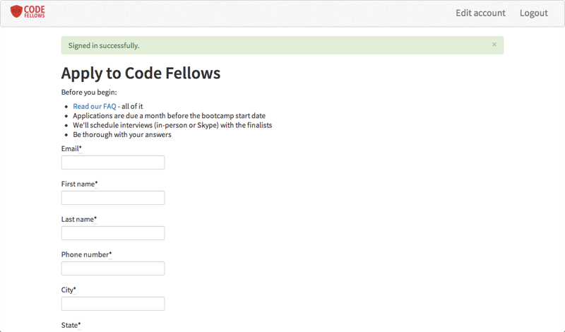
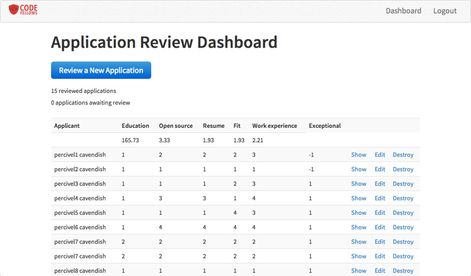

# AppFunnel
An application created for [Code Fellows](http://www.codefellows.org) handling prospective student applications.

The app allows students to apply through a web form and then Code Fellows staff can review and rate the applications and request interviews from applicants.

## Installation

Rename `config/initializers/secret_token.rb.template` to `secret_token.rb` and set a random secret token for your application.

    bundle
    rake db:migrate

Change the `seeds.rb` for the admin.

If you want sample data with test admin and user accounts:

    rake db:populate

---

The MIT License (MIT)

Copyright (c) 2013 Billy Shih and Meris Williams

Permission is hereby granted, free of charge, to any person obtaining a copy
of this software and associated documentation files (the "Software"), to deal
in the Software without restriction, including without limitation the rights
to use, copy, modify, merge, publish, distribute, sublicense, and/or sell
copies of the Software, and to permit persons to whom the Software is
furnished to do so, subject to the following conditions:

The above copyright notice and this permission notice shall be included in
all copies or substantial portions of the Software.

THE SOFTWARE IS PROVIDED "AS IS", WITHOUT WARRANTY OF ANY KIND, EXPRESS OR
IMPLIED, INCLUDING BUT NOT LIMITED TO THE WARRANTIES OF MERCHANTABILITY,
FITNESS FOR A PARTICULAR PURPOSE AND NONINFRINGEMENT. IN NO EVENT SHALL THE
AUTHORS OR COPYRIGHT HOLDERS BE LIABLE FOR ANY CLAIM, DAMAGES OR OTHER
LIABILITY, WHETHER IN AN ACTION OF CONTRACT, TORT OR OTHERWISE, ARISING FROM,
OUT OF OR IN CONNECTION WITH THE SOFTWARE OR THE USE OR OTHER DEALINGS IN
THE SOFTWARE.
